# FitTracker — Database Documentation

> **Database:** `fittrackerDB` &nbsp;|&nbsp; **Type:** MongoDB Atlas (NoSQL) &nbsp;|&nbsp; **Connection:** `MONGODB_URI` environment variable

---

## ER Diagram

```mermaid
erDiagram
    users {
        string id PK
        string email UK
        string password
        string name
        number age
        number weight
        number height
        string fitnessGoal
        date createdAt
    }

    foodEntries {
        string id PK
        string userId FK
        string date
        string name
        number calories
        number protein
        number carbs
        number fat
        number quantity
        string unit
        string mealType
        date createdAt
    }

    nutritionGoals {
        string id PK
        string userId UK
        number calories
        number protein
        number carbs
        number fat
        date createdAt
        date updatedAt
    }

    mealPlans {
        string id PK
        string userId FK
        string name
        string startDate
        string endDate
        array meals
        date createdAt
    }

    workoutSessions {
        string id PK
        string userId FK
        string date
        string name
        string type
        array exercises
        number totalDuration
        string difficulty
        boolean completed
        date completedAt
        array completedExercises
    }

    workoutPlans {
        string id PK
        string userId FK
        string name
        string goal
        string startDate
        string endDate
        array sessions
        date createdAt
    }

    hydration {
        string id PK
        string userId FK
        string date
        number amount
        number goal
        array entries
    }

    fitnessMetrics {
        string id PK
        string userId FK
        string date
        number steps
        number caloriesBurned
        object heartRate
        number distance
        number activeMinutes
        date syncedAt
        string source
    }

    fitnessGoals {
        string userId UK
        number dailySteps
        number dailyCalories
        number activeMinutes
        number weeklyWorkouts
    }

    achievements {
        string id PK
        string userId FK
        string type
        string title
        string description
        number threshold
        boolean achieved
        date achievedAt
        string icon
    }

    gamificationProfiles {
        string userId UK
        number level
        number totalPoints
        number currentLevelPoints
        number nextLevelPoints
        array badges
        object streaks
        date lastActive
        date createdAt
    }

    activityLogs {
        string id PK
        string userId FK
        string type
        string description
        number points
        object badge
        date timestamp
    }

    conversations {
        string userId UK
        array messages
        date lastUpdated
    }

    users ||--o{ foodEntries        : "logs"
    users ||--o| nutritionGoals     : "has"
    users ||--o{ mealPlans          : "has"
    users ||--o{ workoutSessions    : "does"
    users ||--o{ workoutPlans       : "follows"
    users ||--o{ hydration          : "tracks"
    users ||--o{ fitnessMetrics     : "records"
    users ||--o| fitnessGoals       : "sets"
    users ||--o{ achievements       : "earns"
    users ||--o| gamificationProfiles : "has"
    users ||--o{ activityLogs       : "generates"
    users ||--o| conversations      : "has"
```

---

## Collections

### 1. `users`
Stores registered user accounts with personal profile data.

| Field | Type | Constraint | Description |
|---|---|---|---|
| `_id` | ObjectId | Auto | MongoDB internal ID |
| `id` | string | Unique | Custom UUID |
| `email` | string | **Unique** | Lowercase email |
| `password` | string | Required | bcrypt hashed |
| `name` | string | Required | Display name |
| `age` | number | Optional | |
| `weight` | number | Optional | In kg |
| `height` | number | Optional | In cm |
| `fitnessGoal` | enum | Optional | `lose_weight` \| `gain_muscle` \| `maintain_fitness` |
| `createdAt` | Date | Required | |

**Indexes:** `email` (unique), `id` (unique)

---

### 2. `foodEntries`
Individual food/meal log entries per user per day.

| Field | Type | Constraint | Description |
|---|---|---|---|
| `id` | string | Unique | |
| `userId` | string | Required | → `users.id` |
| `date` | string | Required | Format: YYYY-MM-DD |
| `name` | string | Required | Food item name |
| `calories` | number | Required | Total (qty × unit cal) |
| `protein` | number | Required | Grams |
| `carbs` | number | Required | Grams |
| `fat` | number | Required | Grams |
| `quantity` | number | Required | Number of servings |
| `unit` | string | Required | e.g. "serving", "g" |
| `mealType` | enum | Required | `breakfast` \| `lunch` \| `dinner` \| `snack` |
| `createdAt` | Date | Required | |

**Indexes:** `(userId + date)`, `id` (unique), `mealType`

---

### 3. `nutritionGoals`
Daily nutrition targets per user. One document per user (upserted).

| Field | Type | Constraint | Description |
|---|---|---|---|
| `id` | string | Required | |
| `userId` | string | **Unique** | → `users.id` |
| `calories` | number | Required | Daily calorie target |
| `protein` | number | Required | Grams |
| `carbs` | number | Required | Grams |
| `fat` | number | Required | Grams |
| `createdAt` | Date | Required | |
| `updatedAt` | Date | Required | |

**Indexes:** `userId` (unique)

---

### 4. `mealPlans`
AI-generated or user-created multi-day meal plans.

| Field | Type | Constraint | Description |
|---|---|---|---|
| `id` | string | Unique | |
| `userId` | string | Required | → `users.id` |
| `name` | string | Required | e.g. "LOSE WEIGHT Plan" |
| `startDate` | string | Required | YYYY-MM-DD |
| `endDate` | string | Required | YYYY-MM-DD |
| `meals` | MealPlanEntry[] | Required | Embedded array of daily meals |
| `createdAt` | Date | Required | |

**Embedded `MealPlanEntry`:** `{ id, date, mealType, foods[], totalCalories, totalProtein, totalCarbs, totalFat }`

**Indexes:** `(userId + startDate)`, `id` (unique)

---

### 5. `workoutSessions`
Individual workout sessions created within a plan.

| Field | Type | Constraint | Description |
|---|---|---|---|
| `id` | string | Unique | |
| `userId` | string | Required | → `users.id` |
| `date` | string | Required | YYYY-MM-DD |
| `name` | string | Required | Session label |
| `type` | enum | Required | `strength` \| `cardio` \| `yoga` \| `flexibility` \| `hiit` \| `mixed` |
| `exercises` | Exercise[] | Required | Embedded array |
| `totalDuration` | number | Required | Minutes |
| `difficulty` | enum | Required | `beginner` \| `intermediate` \| `advanced` |
| `completed` | boolean | Required | Default: false |
| `completedAt` | Date | Optional | When marked done |
| `completedExercises` | string[] | Required | Array of exercise IDs |

**Embedded `Exercise`:** `{ id, name, type, duration?, sets?, reps?, restTime?, difficulty, instructions, targetMuscles[], equipment[], caloriesBurned? }`

**Indexes:** `(userId + date)`, `id` (unique), `completed`

---

### 6. `workoutPlans`
Multi-week training programs assigned to a user.

| Field | Type | Constraint | Description |
|---|---|---|---|
| `id` | string | Unique | |
| `userId` | string | Required | → `users.id` |
| `name` | string | Required | e.g. "Weight Loss Program" |
| `goal` | enum | Required | `weight_loss` \| `muscle_gain` \| `flexibility` \| `endurance` \| `general_fitness` |
| `startDate` | string | Required | YYYY-MM-DD |
| `endDate` | string | Required | YYYY-MM-DD |
| `sessions` | WorkoutSession[] | Required | Embedded sessions |
| `createdAt` | Date | Required | |

**Indexes:** `(userId + startDate)`, `id` (unique), `goal`

---

### 7. `hydration`
Daily water intake tracking. One document per user per day.

| Field | Type | Constraint | Description |
|---|---|---|---|
| `id` | string | Unique | |
| `userId` | string | Required | → `users.id` |
| `date` | string | Required | YYYY-MM-DD |
| `amount` | number | Required | Total ml consumed today |
| `goal` | number | Required | Daily goal in ml (from weight × 33) |
| `entries` | `{time, amount}[]` | Required | Each individual intake log |

**Indexes:** `(userId + date)`, `id` (unique)

---

### 8. `fitnessMetrics`
Daily activity data synced from Google Fit or entered manually.

| Field | Type | Constraint | Description |
|---|---|---|---|
| `id` | string | Unique | |
| `userId` | string | Required | → `users.id` |
| `date` | string | Required | YYYY-MM-DD |
| `steps` | number | Required | Step count |
| `caloriesBurned` | number | Required | Total kcal |
| `heartRate` | object | Required | `{ average, min, max, readings[] }` |
| `distance` | number | Required | Meters |
| `activeMinutes` | number | Required | |
| `syncedAt` | Date | Required | Last sync timestamp |
| `source` | enum | Required | `manual` \| `google_fit` \| `device` |

**Indexes:** `(userId + date)`, `id` (unique), `source`

---

### 9. `fitnessGoals`
Per-user activity targets. One document per user (auto-created with defaults).

| Field | Type | Constraint | Description |
|---|---|---|---|
| `userId` | string | **Unique** | → `users.id` |
| `dailySteps` | number | Required | Default: 10,000 |
| `dailyCalories` | number | Required | Default: 2,000 |
| `activeMinutes` | number | Required | Default: 30 |
| `weeklyWorkouts` | number | Required | Default: 4 |

**Indexes:** `userId` (unique)

---

### 10. `achievements`
Fitness milestone badges unlocked by user activity.

| Field | Type | Constraint | Description |
|---|---|---|---|
| `id` | string | Unique | |
| `userId` | string | Required | → `users.id` |
| `type` | enum | Required | `steps` \| `calories` \| `workouts` \| `streak` |
| `title` | string | Required | e.g. "Step Master" |
| `description` | string | Required | |
| `threshold` | number | Required | Goal value to unlock |
| `achieved` | boolean | Required | |
| `achievedAt` | Date | Optional | |
| `icon` | string | Required | Emoji icon |

**Indexes:** `(userId + achievedAt)`, `id` (unique), `type`

---

### 11. `gamificationProfiles`
Points, levels, badges and streaks. One document per user.

| Field | Type | Constraint | Description |
|---|---|---|---|
| `userId` | string | **Unique** | → `users.id` |
| `level` | number | Required | Current level (starts at 1) |
| `totalPoints` | number | Required | All-time accumulated points |
| `currentLevelPoints` | number | Required | Points towards next level |
| `nextLevelPoints` | number | Required | Points needed to level up |
| `badges` | Badge[] | Required | Embedded array of earned badges |
| `streaks` | object | Required | `{ workout, nutrition, hydration, overall }` |
| `lastActive` | Date | Required | |
| `createdAt` | Date | Required | |

**Embedded `Badge`:** `{ id, name, description, icon, category, earnedAt, isSeen }`

**Point Structure:**

| Action | Points |
|---|---|
| Workout completed | +50 |
| Workout bonus (>45 min) | +25 |
| Meal logged | +10 |
| Daily nutrition goal met | +30 |
| Hydration goal met | +20 |
| Hydration bonus (>150%) | +15 |
| 7-day streak | +100 |
| 30-day streak | +300 |
| 100-day streak | +1000 |

**Indexes:** `userId` (unique), `totalPoints` (desc), `level` (desc)

---

### 12. `activityLogs`
Timestamped gamification event history per user.

| Field | Type | Constraint | Description |
|---|---|---|---|
| `id` | string | Unique | |
| `userId` | string | Required | → `users.id` |
| `type` | enum | Required | `points_earned` \| `badge_earned` \| `level_up` \| `streak_milestone` |
| `description` | string | Required | Human-readable reason |
| `points` | number | Optional | Points awarded (if applicable) |
| `badge` | Badge | Optional | Badge object (if applicable) |
| `timestamp` | Date | Required | |

**Indexes:** `(userId + timestamp)`, `type`

---

### 13. `conversations`
AI chat history per user. One document per user with embedded messages array.

| Field | Type | Constraint | Description |
|---|---|---|---|
| `userId` | string | **Unique** | → `users.id` |
| `messages` | Message[] | Required | Embedded array of all chat messages |
| `lastUpdated` | Date | Required | |

**Embedded `Message`:** `{ id, userId?, role: 'user'|'assistant'|'system', content, timestamp }`

**AI Model:** Groq — `llama-3.3-70b-versatile`

**Indexes:** `userId` (unique), `lastUpdated` (desc)

---

## Index Summary

| Collection | Indexes |
|---|---|
| `users` | `email` (unique), `id` (unique) |
| `foodEntries` | `(userId+date)`, `id` (unique), `mealType` |
| `nutritionGoals` | `userId` (unique) |
| `mealPlans` | `(userId+startDate)`, `id` (unique) |
| `workoutSessions` | `(userId+date)`, `id` (unique), `completed` |
| `workoutPlans` | `(userId+startDate)`, `id` (unique), `goal` |
| `hydration` | `(userId+date)`, `id` (unique) |
| `fitnessMetrics` | `(userId+date)`, `id` (unique), `source` |
| `fitnessGoals` | `userId` (unique) |
| `achievements` | `(userId+achievedAt)`, `id` (unique), `type` |
| `gamificationProfiles` | `userId` (unique), `totalPoints` (desc), `level` (desc) |
| `activityLogs` | `(userId+timestamp)`, `type` |
| `conversations` | `userId` (unique), `lastUpdated` (desc) |

**Total: 13 Collections · 27 Indexes**
